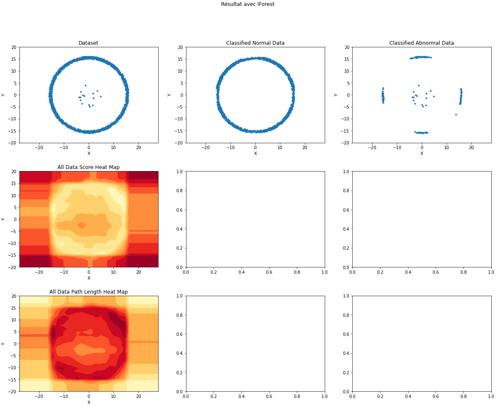

This project is to depth study IForest method and to proposed a new version named MVIForest

# New Contents
# Prerequisites
## Tools
    - Anaconda 1.9.7
    - Jupiter Notebook
    - Spyder
    - Installer git (sudo pip install git)
    - Installer numpy (sudo pip install numpy)
    - Installer pandas (sudo pip install pandas)
    - Installer sklearn (sudo pip install sklearn)
    - Installer imblearn (sudo pip install imblearn) (pip install -U imbalanced-learn) (https://imbalanced-learn.org/stable/metrics.html)
    - Installer eif (sudo pip install eif)(pip install git+https://github.com/sahandha/eif.git)
    - Installer scipy (sudo pip install scipy)
    - Installer matplotlib (sudo pip install matplolib)
    - Install pip install ipywidgets  jupyter nbextension enable --py widgetsnbextension
## Possible errors
    Generally restart the kernel after every installation
    - ModuleNotFoundError: No module named 'imblearn'
    Solution : Install imblearn
    - cannot import name 'delayed' from 'sklearn.utils.fixes' (/Users/togbe/opt/anaconda3/lib/python3.8/site-packages/sklearn/utils/fixes.py)
    Solution : Just restart the kernel
    - ModuleNotFoundError: No module named 'eif'
    Solution : Install EIF
## Datasets
### Synthetics datasets links 
    - image generator : http://localhost:8888/notebooks/Documents/DeveloppementGit/IForestStudyAndMVIForest/datasets/images_generator.ipynb
    - Datasets generator : http://localhost:8888/edit/Documents/DeveloppementGit/IForestStudyAndMVIForest/datasets/datasets_generator.py
    - 2D dataset generation : http://localhost:8888/notebooks/Documents/DeveloppementGit/IForestStudyAndMVIForest/datasets/synthetic_2D_data/2D_dimension_datasets_generation.ipynb
    - 2D dataset data, old and new images, description : http://localhost:8888/tree/Documents/DeveloppementGit/IForestStudyAndMVIForest/datasets/synthetic_2D_data/Synthetics_2D
    - 3D dataset generation : http://localhost:8888/tree/Documents/DeveloppementGit/IForestStudyAndMVIForest/datasets/synthetic_3D_data
    - Synthetics datasets used in the paper :
    - 2.0.0 ==> Synthetic 5 (TwoD2_V2_0_0())
        * 3.3.0 ==> Synthetic 1 (TwoD2_V3_3_0())
        * 3.4.0 ==> Synthetic 2 (TwoD2_V3_4_0())
        * 4.3.0 ==> Synthetic 6 (TwoD2_V4_3_0())
        * 4.3.1 ==> Synthetic 3 (TwoD2_V4_3_1())
        * 4.3.2 ==> Synthetic 4 (TwoD2_V4_3_2())
    
### Public datasets
http://localhost:8888/tree/Documents/DeveloppementGit/IForestStudyAndMVIForest/datasets/datasets_publics

## Execution
### Comparison IForest, EIF, MVIForest
    - On 2D synthetics datasets : http://localhost:8888/notebooks/Documents/DeveloppementGit/IForestStudyAndMVIForest/od_methods/IsoFo/IForest_Analysis/dimension_influence_IForestImplementation/execution_result_description/NewsDatasets_28082020/Comparison_IForest_EIF_MVIForest_2D_SyntheticsData_V30102020_ToChangeNumberOfScores.ipynb
    - All the files (execution, result and images) : http://localhost:8888/tree/Documents/DeveloppementGit/IForestStudyAndMVIForest/od_methods/IsoFo/IForest_Analysis/dimension_influence_IForestImplementation/execution_result_description/NewsDatasets_28082020
    
    - Regeneration of image with same axis scale : http://localhost:8888/tree/Documents/DeveloppementGit/IForestStudyAndMVIForest/od_methods/IsoFo/IForest_Analysis/dimension_influence_IForestImplementation/execution_result_description/NewsDatasets_28082020/Figures/2021-10-19/saved_images

*******************************************************************************************************************************

# Old Contents (To delete)
# Table of contents
- [Pré-réquis](#Pré-réquis)
- [Summary](#Summary)
- [Motivation](#Motivation)
- [This Git Organisation](#Organisation)
    - [Datasets](#Datasets)
        - [Synthetics Datasets](#Synthetics-Datasets)
        - [Publics Datasets](#Publics-Datasets)
- [Isolation Forest](#Isolation-Forest)
- [Experiments](#Experiments)
    - [Comparison between IForest and Extended IF](#Comparison-IForest-VS-Extended-IForest)
    - [Differents experiments on IForest, EIF and MVIForest](#Others-differents-experiments)
- [Comparative Study](#Motivation)
    - [Local Outlier Factory (LOF)]
    - [One Class SUpport Vector Machine (OC-SVM)]
    - [Isolation Forest]
    - [Datasets]
    - [Results]
    - [Publication]
- [Implementation of IForestASD on Scikit-Multiflow](#Motivation)
    - [Isolation Forest for Anomaly destection in Stream Data (IForest ASD)]
    - [Scikit-Multiflow]
    - [Half Space Trees (HS-Trees)]
    - [Datasets]
    - [Results]
    - [Publication]
- [Existings improvements of IForest](#Motivation)

- [our Improvements](#Motivation)
    - [MajorityVoting Isolation Forest](#Isolation-Forest)
    - [The Code](#The-Code)
- [Installation](#Installation)
    - [Requirements](#Requirements)
- [Use](#Use)
- [Citation](#Citation)
- [Releases](#Releases)

# Pré-réquis
## Outils
    - Anaconda 1.9.7
    - Jupiter Notebook
    - Spyder
    - Installer git (sudo pip install git)
    - Installer numpy (sudo pip install numpy)
    - Installer pandas (sudo pip install pandas)
    - Installer sklearn (sudo pip install sklearn)
    - Installer imblearn (sudo pip install imblearn) (pip install -U imbalanced-learn)
    - Installer eif (sudo pip install eif)(pip install git+https://github.com/sahandha/eif.git)
    - Installer scipy (sudo pip install scipy)
    - Installer matplotlib (sudo pip install matplolib)
    - Install pip install ipywidgets  jupyter nbextension enable --py widgetsnbextension

# Summary
# Motivation
# Organisation
## Datasets
To manage datasets, we provide some functions availlable in [Datasets Management](https://github.com/Elmecio/OD_Jupyter/blob/master/datasets/datasets.py)
### Generator & Fonctions
#### Synthetics datasets generator
##### Generation
To generate the dataset, we provide some functions availlable in  [Synthetics Dataset Generator](https://github.com/Elmecio/OD_Jupyter/blob/master/datasets/datasets_generator.py)
We have created differents synthetics datasets in order to test the limits of IForest.
Those datasets have the specifities to have all data described by many dimensions. So, to really detect anomalies, algorithms have to consider many dimensions at the same time.
###### 1 Dimension : 
Examples of 1-D synthetics datasets generation is avaible on [notebook here](datasets/synthetic_1D_data/1D_dimension_datasets_generation.ipynb)
Generated datasets (data:.csv, description:.txt and image:.png) are avaible in [the dedicated folder](datasets/synthetic_1D_data/synthetics_1D_data/)

###### 2 Dimensions : 
Examples of 2-D synthetics datasets generation is avaible on [notebook here](https://github.com/Elmecio/OD_Jupyter/blob/master/datasets/synthetic_2D_data/2D_dimension_datasets_generation.ipynb)
Generated datasets (data:.csv, description:.txt and image:.png) are avaible in [the dedicated folder](datasets/synthetic_2D_data/synthetics_2D_data/)
**Figure**: Shows an example of a generated 2 dimensions synthetic dataset.

###### 3 Dimensions : 
Examples of 3-D synthetics datasets generation is avaible on [notebook here](https://github.com/Elmecio/OD_Jupyter/blob/master/datasets/synthetic_3D_data/3D_dimension_datasets_generation.ipynb)
Generated datasets (data:.csv, description:.txt and image:.png) are avaible in [the dedicated folder](datasets/synthetic_3D_data/synthetics_3D_data/)
**Figure**: Shows an example of a generated 3 dimensions synthetic dataset.

###### More than 3 Dimensions : 
Name : 
Parameters : 
Some exemples of how to use the functions are availlable in 

##### Registration
The generated dataset name is constructed with the following pattern : "synthetic_"+n_dimension+"_dataset_V"+version+"_"+x_lim+"_"+y_lim+"_"+z_lim+"_"+datetime
- The generated dataset is saved in .csv file with the name
- The generated dataset description is saved in .txt file with the name
- The generated dataset image is saved in .png file with the name.
All generated datasets and their image and description files are saved in the appropriate folder.

### Publics Datasets
For differents tests, we used differents publics datasets availlable online.
Those publics datasets are in the folder datasets/dataset_publics/
    - shuttle-unsupervised-ad_2019-06-14 17:33:02.493755.csv
    - kdd99-unsupervised-ad_2019-06-24 16:08:29.815617.csv
    - HTTP.csv
    - ForestCover.csv
    - Shuttle.csv
    - SMTP.csv
# Isolation-Forest
# Experiments
## Comparison IForest VS Extended IForest
We compare IForest and Extended IForest on publics datasets.
The notebook and the results are availlable in [IForest VS Extended IForest](https://github.com/Elmecio/OD_Jupyter/blob/master/od_methods/IsoFo/IForest_Analysis/dimension_influence_IForestImplementation/execution_result_description/result_description_for_PublicsDatasets.ipynb)
## Others differents experiments
Here we put all the links of files for differents experiences on IForest, EIF and MVIForest
### Methods Way to Split Datasets
This show how the differents methods split datasets on their trainning phase. It also show the scores heatmap of all of the methods.
The notebook is availlable on [Show Trainning Splitting of IForest and EIF on synthetics datasets](od_methods/IsoFo/IForest_Analysis/dimension_influence_IForestImplementation/execution_result_description/Show_Trainning_Cutting_WithMVIForest_V22072020.ipynb)
**Figure**: IForest scores heat map, nodes splitting and example of sample for one tree.

**Figure**: EIF scores heat map, nodes splitting and example of sample for one tree.
### IForest VS MVIForest on publics datasets
We compare IForest and Majority Voting IForest on publics datasets.
The notebook and the results are availlable in [IForest VS MVIForest](https://github.com/Elmecio/OD_Jupyter/blob/master/od_methods/IsoFo/IForest_Analysis/dimension_influence_IForestImplementation/ScoreFormularAnalysis/MajorityVoting_Publics_datasets_13072020.ipynb)
### IForest, EIF and MVIForest trainning only on normals data
This show how the differents methods results when the trainning is only on the normals data. The goal of this experiment is to compare the performances of the differents methods when the samples used to build the itrees contains abnormals data or not.
The notebook is availlable on [Show results of IForest, MVIForest and EIF when trained only on normals data](od_methods/IsoFo/IForest_Analysis/dimension_influence_IForestImplementation/Normal_Data_For_Train/New_Datasets/result_description_for_2D_NormalOnly.ipynb)
**Figure**: IForest performances on one 2D synthetics dataset
**Figure**: IForest results on one 2D synthetics dataset
**Figure**: IForest results distribution on one 2D synthetics dataset

### Methods comparison (IForest VS MVIForest VS EIF)
This present a comparison between IForest, MVIForest and EIF on synthetics datasets.
#### Synthetics 2D 
The notebook is availlable on [Comparison between IForest, MVIForest and EIF on 2D synthetics datasets](od_methods/IsoFo/IForest_Analysis/dimension_influence_IForestImplementation/execution_result_description/NewsDatasets_28082020/Comparison_IForest_EIF_MVIForest_2D_SyntheticsData_V28082020.ipynb)
**Figure**: MVIForest performances on one 2D synthetics dataset
**Figure**: MVIForest results on one 2D synthetics dataset
**Figure**: MVIForest results distribution on one 2D synthetics dataset
#### Synthetics 3D 
The notebook is availlable on [Comparison between IForest, MVIForest and EIF on 3D synthetics datasets](od_methods/IsoFo/IForest_Analysis/dimension_influence_IForestImplementation/execution_result_description/NewsDatasets_28082020/Comparison_IForest_EIF_MVIForest_3D_SyntheticsData_V28082020.ipynb)
**Figure**: MVIForest performances on one 3D synthetics dataset
**Figure**: MVIForest results on one 3D synthetics dataset
**Figure**: MVIForest results distribution on one 3D synthetics dataset

# Kmeans
The outliers detection is possible with Kmeans but there are many ways to it with this method
1. Kmeans + Distance
    After applying Kmeans on the dataset, we can use the distance between the observations and the cluster center to detect the outliers.
    To use Kmeans for outlier detection, we need to specify the threshood (distance beyond which all observations may be considered as outliers) or the top n (n top observations which have the higgest distance from the cluster center)
    1.1 Case of one cluster (n_clusters = 1)
        In this case, we consider all the dataset as one cluster and the utility of kmeans here is just to help use to find the best center of the dataset (KMeans(n_clusters).fit(X))
        After this step, we calculate the distance between the center and all observations (transform)
    1.2 Case of more dans one cluster (n_cluster >= 2)
        1.2.1 The cluster which is the most far from the whole dataset center is the cluster of outliers (Global outlier)
        1.2.2 The observations 
2. Kmeans + center based
    First : Use Kmeans with n_clusters = 1. and find the best observation which is the center of the dataset
    Second : Use Kmeans with n_clusters = 2
        The cluster wich content the center of all the dataset is the normal cluster. The other one is the ouliers cluster.
3. Kmeans + Density based
    The cluster which has the smallest number of observations is the cluster of outliers
4. Kmeans + Z-score
    Observations in Top n or Z-scorei greater dans threshood are outliers
5. Kmeans + Grubb's test (or variante)
    The cluster which content the outlier observation designed by Grubb's test (or variante) is the cluster of outliers
6.

# Mesures de performance
 ## Mesure de la précision avec la validation croisée
 ## Matrice de confusion
 ## Matrice de confusion de Scikit-learn et Détection d'anomalies
     tn ==> tp
     fn ==> fp
     fp ==> fn
     vp ==> vn
 ## Spécificité et rappel
 ## Spécificité/Rappel compromis
 ## La courbe ROC
 ## L'aire sous la courbe ROC

